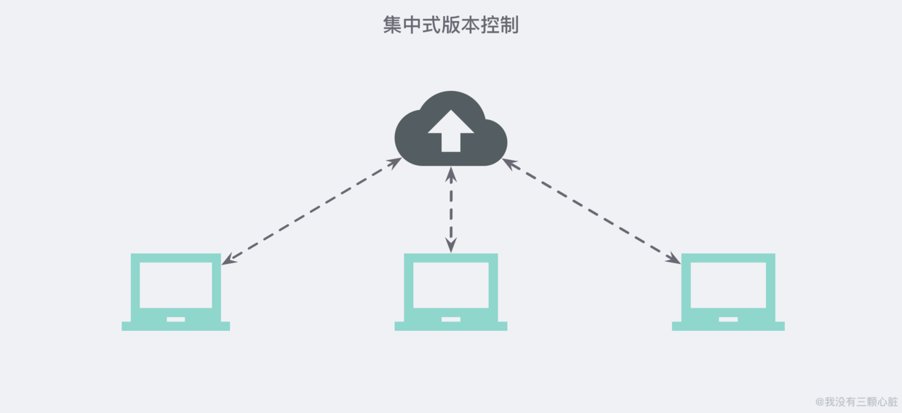
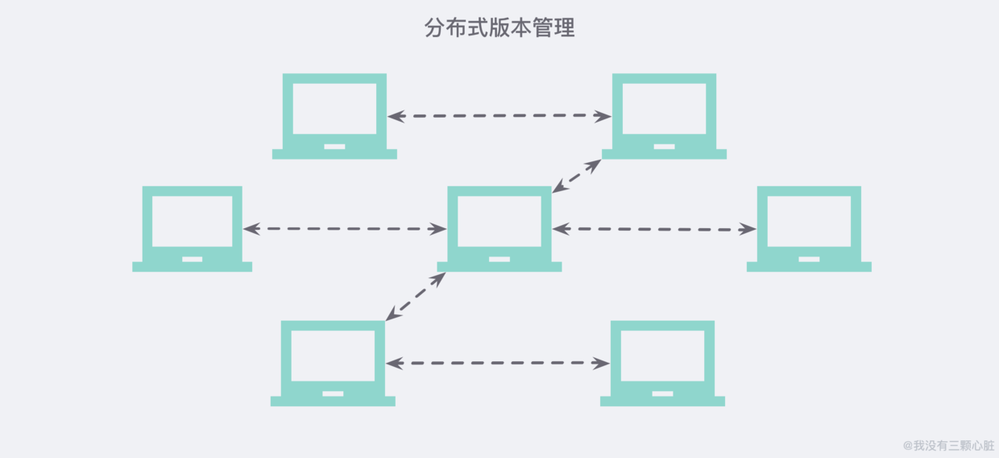
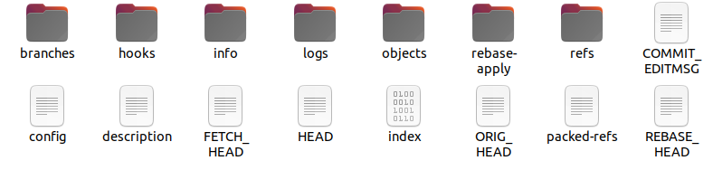
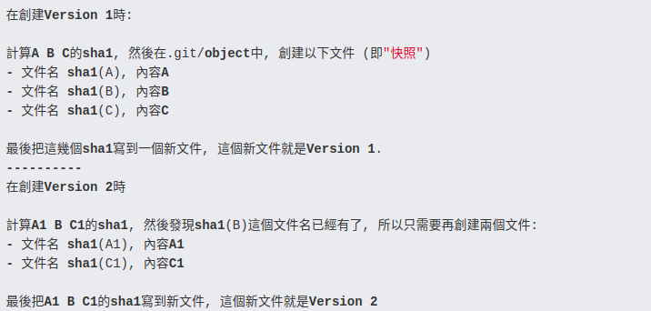
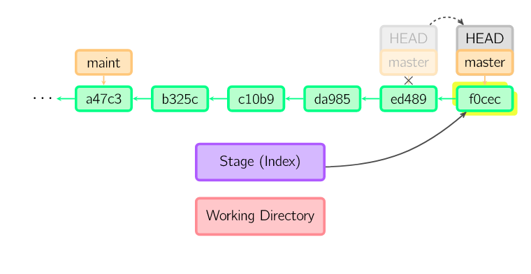
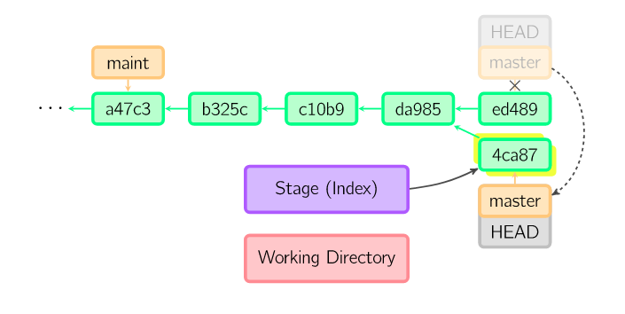
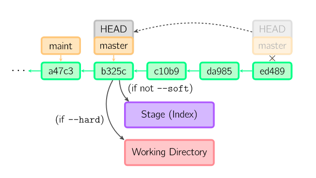

## Git是什么
Git是一个分布式版本控制工具 ，
最早是用于Linux内核开发的版本控制  
#### 版本控制
版本控制就是对文件变更过程的管理 ,把一个文件或一些文件的各个版本按一定的方式管理起来，目的是需要用到某个版本的时候可以随时使用。

#### 集中式（SVN）
  
- 版本库是集中存放在中央服务器的 ,工作时使用自己的电脑从中央服务器取得最新的版本 ,工作结束后再把自己的修改推送给中央服务器  
- **优势:**   
1. 每个人都可以一定程度上看到项目中的其他人正在做些什么。而管理员也可以轻松掌控每个开发者的权限.  
- **劣势:**  
1. 没有网络或者断开VPN你就无法做任何事情  
2. 中央服务器的单点故障，那么谁都无法提交更新、还原、对比等，也就无法协同工作 。如果没做过备份或者备份得不够及时的话，有丢失数据的风险。

#### 分布式
  
- 没有 “中央服务器”，每个人的电脑上都是一个完整的版本库 ，当多人协作时 ，只需把各自的修改推送给对方，就可以互相看到对方的修改了.  
- **优势:**  
1. 在分布式版本控制系统中，客户端并不只提取最新版本的文件快照，而是把原始的代码仓库完整地镜像下来.
这么一来，任何一处协同工作用的服务器发生故障，事后都可以用任何一个镜像出来的本地仓库恢复;  
2. 另外，因为Git在本地磁盘上就保存着所有有关当前项目的历史更新，并且Git中的绝大多数操作都只需要访问本地文件和资源，不用连网，所以处理起来速度飞快;  
3. 大多数操作本地进行，数度更快，不受网络与物理位置限制，不联网也可以提交代码、查看历史、切换分支等等.  
- **劣势：**  
1. 学习周期相对而言比较长;
2. 代码保密性差,一旦开发者把整个库克隆下来就可以完全公开所有代码和版本信息.

## Git能做什么
####从一般开发者的角度来看，git有以下功能：
1. 从服务器上克隆完整的Git仓库（包括代码和版本信息）到单机上 ,并在自己的机器上创建分支，修改代码
2. 在单机上自己创建的分支上提交代码。
3. 多人协作开发
4. 在单机上合并分支。
5. 把服务器上最新版的代码fetch下来，然后跟自己的主分支合并。
6. 生成补丁（patch），把补丁发送给主开发者。
7. 解决开发者之间的冲突（主开发者与一般开发者 / 多个一般开发者 ）
从主开发者的角度（假设主开发者不用开发代码）看，git有以下功能：
1. 查看邮件或者通过其它方式查看一般开发者的提交状态。
2. 打上补丁，解决冲突
3. 向公共服务器提交结果，然后通知所有开发人员。

## Git的工作流程  
  
Workspace：工作区  
Index / Stage：暂存区  
Repository：仓库区（或本地仓库）  
Remote：远程仓库  
( 当git add 之后 ，文件进入暂存区 ，同时修改暂存区中HEAD指向当前的
本地仓库中的HEAD指向当前branch（默认为master) ,branch指向一个引用 ，这个引用本质是commit或者branch的SHA1码
当git commit时 ，将Index区的文件生成快照 ，将快照传入本地仓库 ，修改本地仓库中的HEAD指向为最新commit
（在Git仓库里面，HEAD、分支、普通的Tag可以简单的理解成是一个指针，指向对应commit的SHA1值） )

## Git的目录结构
  
- HEAD: 存储的是当前所在分支的Hash码
- config: 存储的是当前项目的git config
- hooks: 存储客户端和服务端的一些钩子脚本
- objects: 存储所有的文件对象 ,Git中的文件和一些操作都会以git对象来保存，git对象分为BLOB、tree和commit ，tag四种类型  
每一个Objects以40位的校验和表示 ，校验和的前两个字符用于命名子目录，余下的 38 个字符则用作文件名
objects文件夹中会包含很多的子文件夹，其中Git对象保存在以其sha-1值的前两位为子文件夹、后38位位文件名的文件中；除此以外，Git为了节省存储对象所占用的磁盘空间，会定期对Git对象进行压缩和打包，其中pack文件夹用于存储打包压缩的对象，而info文件夹用于从打包的文件中查找git对象；
- index: 保存暂存区信息 ,内容包括它指向的文件的时间戳、文件名、sha1值等；
- packed-refs : git gc 时产生的文件 ，是 .git/refs下所有heads和tags的打包
#### 发生SHA1冲突时

- Git不是简单的将数据内容进行Hash ， 而是通过 数据类型 + 数据长度 + 一个空格 + 数据内容 来进行Hash 。

#### Git的快照
- Git会读取当前工作空间中的所有数据进行数据预存 ，再重新调整 ：和上一次的快照版本的内容进行比较 ，对于没有改变的  
文件数据 ，Git会把当前预存中的冗余文件的数据去除掉 ，改为保留指向上一版本中该文件数据的指针 。对于有差异的数据就保留下来   
最终再把完整的数据保留下来
#### 对快照的理解

## Git的快照系统与CVS等的区别
- 最主要的区别在于对待数据保存的方式 ，Git关心文件数据的整体是否发生变化 ，每一次commit时都会保存一次快照 ，且每个快照都保存了完整的数据  
后者主要关心的是文件之间的差异 ，只有第一次快照会记录完整的数据 ，往后的快照都只是记录之前版本和现在两者的变化信息 
#### Git gc
- 由于git每次提交都会提交整个文件的存储快照 ，容易导致代码仓库中 代码的重复率过高 ，因此Git需要gc
- 当运行 "git gc" 命令时，Git会收集所有松散对象并将它们存入 packfile，合并这些 packfile 进一个大的 packfile，
然后将不被任何 commit 引用并且已存在一段时间 (数月) 的对象删除。 此外，Git还会将所有引用 (references) 并入一个单独文件。
- 一般是用户手动操作git gc
    - --prune ： 回收早于指定日期的对象 
--> init一个git仓库 ，然后讲 git config -e / git config --global  /        git init --> git remote add origin gitURL /  
git pull origin master 
// 如果出现以下错误：
fatal: refusing to merge unrelated histories
// 则换一个命令
git pull origin master --allow-unrelated-historie  
git revert :先commit 之后 git log找到commit -it --> git revert commit_id  (crtl + o , ctrl + x) --> git push origin master 

## 演示文件是不会丢失的
echo 'version 1' > test.txt  /  git hash-object -w test.txt /  echo 'version 2' > test.txt /  
git hash-object -w test.txt / cat test.txt /     find .git/objects -type f  ，得到version1的hashcode,  
git cat-file -p hashcode > test.txt , cat test.txt 

## 常用命令
- git add ：把当前文件放入暂存区域
- git commit :  将暂存区域内的文件生成一份快照 ，将快照传入本地仓库 ，并将本地仓库中的HEAD指针指向这次最新的commit
    - 当git commit时 ，git会首先会计算每一个子目录的校验和 ，然后将这些校验和保存为树对象 ，随后创建一个commit对象
    （之所以要创建commit对象 是因为commit对象除了要保存文件快照指针以外 ，还要保存作者的信息 ，父对象的指针以及项目根目录指针）
  
    - git commit -amend :使用与当前提交相同的父节点进行一次新提交，将上一次commit取消  
    1. 将修改的代码 git add .
    2. 使用git commit -amend 
  
- git reset : 用于撤销之前的commit ，
    - git reset --mixed (或者不加参数) :  保留工作目录清空的内容 ，清空暂存区的内容（也就是说没有git commit 和 git add 过）
    - git reset --hard : 会将工作区的目录也更新为指定commit相同的内容（没有发生过git commit 和 git add )
    - git reset --soft : 保留index区和工作目录的内容(类似与已经git add过)  

- git revert : 用于撤销已经push的代码  
实质就是生成一个新的commit ，但是新commit的内容和指定撤销的commit的内容相反
- git rebase : 使用git merge 的话 ，commit历史就会出现分叉 ，可以用rebase代替merge 避免出现commit历史分叉
    - git rebase -i HEAD~n :用于合并本地的多个提交  

## Git命令的底层原理 
Git命令分为procelain和plumbing命令    
- porcelain命令就是我们常用的git add,git commit等命令
- plumbing命令可以理解为更底层的命令，实际上一个porcelain命令可以由若干个plumbing命令完成，plumbing命令可以帮助我们了解git底层的工作原理
1. git add 
    1. 根据文件内容计算SHA-1值(echo 'addTest2' > add2.txt / git hash-object -w add2.txt 得到hashcode)
    2. 将文件内容存储到仓库的数据库中（.git/objects）
    3. 将文件内容注册到.git/index文件中 ((git update-index --add --info-only add2.txt / git ls-files --stage  查看暂存区文件))
    
2. git commit 
    1. 根据当前的工作树生成一个tree对象（tree对象记录了当前工作目录的结构，保存有对当前版本的文件的引用），
    将tree对象保存到.git/objects下 (git write-tree ,得到生成tree对象的hashcode)
    2. 由上述tree对象生成一个commit对象，(git commit-tree -m 'addTest2' hashcode 得到commit对象的hashcode2)
    3. 移动分支到新生成的commit对象 (cat .git/HEAD 得到当前分支指向 / git update-ref  分支指向 hashcode2)